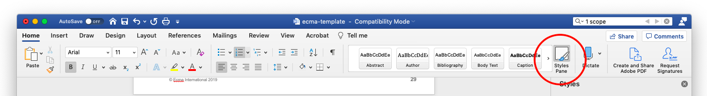
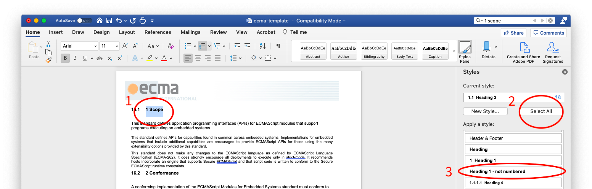
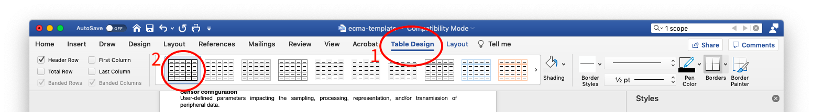

## Converting Markdown specs to Ecma-style docx specs

**Last updated:** April 28, 2023

### Overview

This document explains how to convert the Markdown spec document to a docx file in the Ecma style.

These instructions are written for macOS users. They should be easy to adapt for Windows/Linux users.

This process takes some time because of the manual formatting steps required. The full conversion of ECMA-419 2nd Edition took at least six hours.

### Instructions

1. Install [pandoc](https://pandoc.org/installing.html).
	
	```text
	brew install pandoc
	```
	
2. Install [Microsoft Word](https://www.microsoft.com/en-us/microsoft-365/word).

	Pandoc does not work properly with Pages, even if you convert documents to the `.docx` format. Use Microsoft Word.


3. Put a copy of the markdown spec in this directory and rename it `spec.md`.

	```text
	cp <PATH_TO_SPEC_REPO>/docs/tc53.md ./spec.md
	```

4. Run the conversion script.

	```text
	./md2docx.bat
	```
	
	> Note: you may need to set the file to be executable first.
	> 
	> ```text
	> chmod +x md2docx.bat
	> ```
	
5. The conversion script generates two new files: `spec.html` and `spec.docx`. Open `spec.docx` in Microsoft Word. Also open `ecma-template.docx`.

	```text
	open spec.docx
	open ecma-template.docx
	```
	
6. Copy and paste the text from `spec.docx` into `ecma-template.docx`. The styles will not look correct after this step; that's ok--you will fix them the following steps.

7. Open the styles pane.

	
	
8. Update blocks of text that use incorrect styles. You can select all instances of text that use a particular style by 
 
	1. selecting a single instance,
	2. pressing "Select All" in the styles pane, and 
	3. selecting the style they should all use in the style.

	
	
	To change the style of all the tables, follow steps 1 and 2 above, then
	
	1. select the Table Design menu item,
	2. select the style with black outlines,
	3. and manually check each table to make sure the formatting was applied consistently.
	
	
	
9. Make the following manual edits:

	- Remove the duplicate numbers in the headers
	- Add term numbers to the Terms and Definitions section
	- Left align all of the code blocks
	- Update all of the numbering in the formal algorithms (in annex A) so they restart in each section
	- Update copyright year in page footers

10. The markdown document does not contain the following. They must be added manually

	- title page
	- table of contents (generated based on style headings)

